# Sistem Manajemen Buku

## Authentication

<details markdown="1">
<summary>Click to see details</summary>

THIS IS JUST AN EXAMPLE ON HOW TO ACTUALLY USE IT YOU CAN SIMPLY READ [API.md](API.md) for detailed instruction.  

### Register  

HEADERS:  

- Key :Accept  
- Value :application/json  

Method:POST  
URL:[http://127.0.0.1:8080/api/register](http://127.0.0.1:8080/api/register)  
EXAMPLE OF BODY:  
```
{
    "name": "bazzite",
    "email": "bazzite@gg.com",
    "password": "bazzite.gg",
    "password_confirmation": "bazzite.gg"
}
```
RESPONSE:  
```
{
    "access_token": "1|vVCLpytUJgMSRMiW2zt0AA1qRvftA3DRTqNiMkXAb948770e",
    "token_type": "Bearer",
    "user": {
        "name": "bazzite",
        "email": "bazzite@gg.com",
        "updated_at": "2026-04-17T04:58:22.000000Z",
        "created_at": "2026-04-17T04:58:22.000000Z",
        "id": 1
    }
}
```
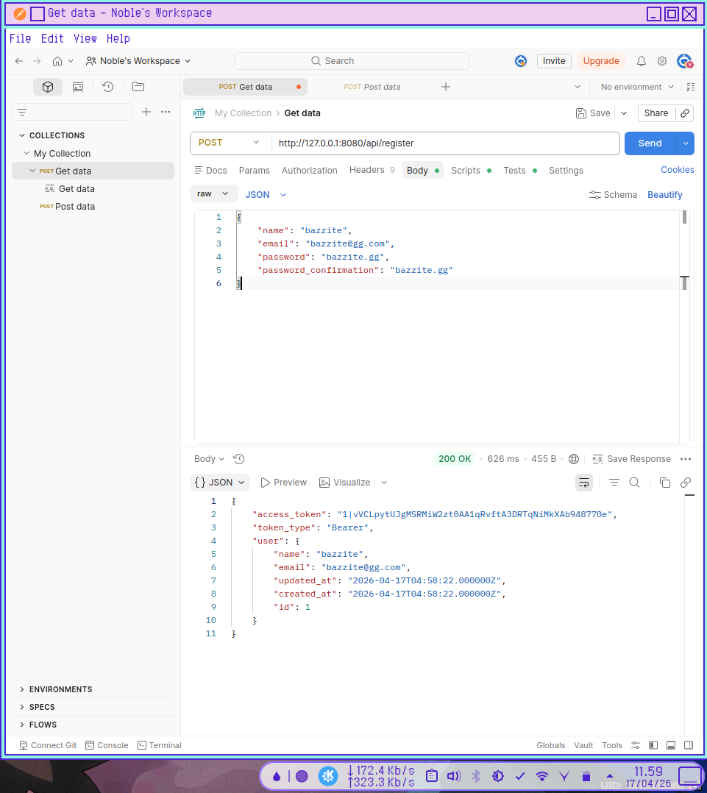   

### 2. Login

METHOD:POST  
URL:[http://127.0.0.1:8080/api/login](http://127.0.0.1:8080/api/login)  
BODY:  
```
{
    "email": "bazzite@gg.com",
    "password": "bazzite.gg"
}
```  

RESPONSE:  
```
{
    "access_token": "2|46svRT1s6HN5XW2kd74No4kiW6Sot4xi5fhSjH3193ba7d98",
    "token_type": "Bearer",
    "user": {
        "id": 1,
        "name": "bazzite",
        "email": "bazzite@gg.com",
        "email_verified_at": null,
        "created_at": "2026-04-17T04:58:22.000000Z",
        "updated_at": "2026-04-17T04:58:22.000000Z"
    }
}
```

</details>

## Category Management

<details markdown="1">
<summary>Click to see details</summary>

### 1. List Categories

* Method: GET
* URL:[http://localhost:8080/api/categories](http://localhost:8080/api/categories)  
* Headers:  
Key:Accept  
Accept: application/json  
Authorization: Bearer  

```
2|46svRT1s6HN5XW2kd74No4kiW6Sot4xi5fhSjH3193ba7d98
```  

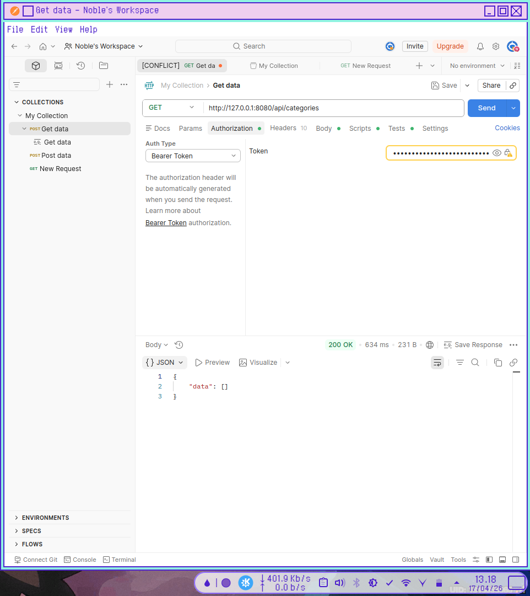  

- **RESPONSE:**
```
{
    "data": [
        {
            "id": 2,
            "name": "Advanced Machine Learning",
            "created_at": "2026-04-17T06:41:32.000000Z",
            "updated_at": "2026-04-17T06:41:32.000000Z"
        },
        {
            "id": 3,
            "name": "Programming",
            "created_at": "2026-04-17T06:42:00.000000Z",
            "updated_at": "2026-04-17T06:42:00.000000Z"
        },
        {
            "id": 4,
            "name": "Math",
            "created_at": "2026-04-17T06:42:45.000000Z",
            "updated_at": "2026-04-17T06:42:45.000000Z"
        }
    ]
}
```
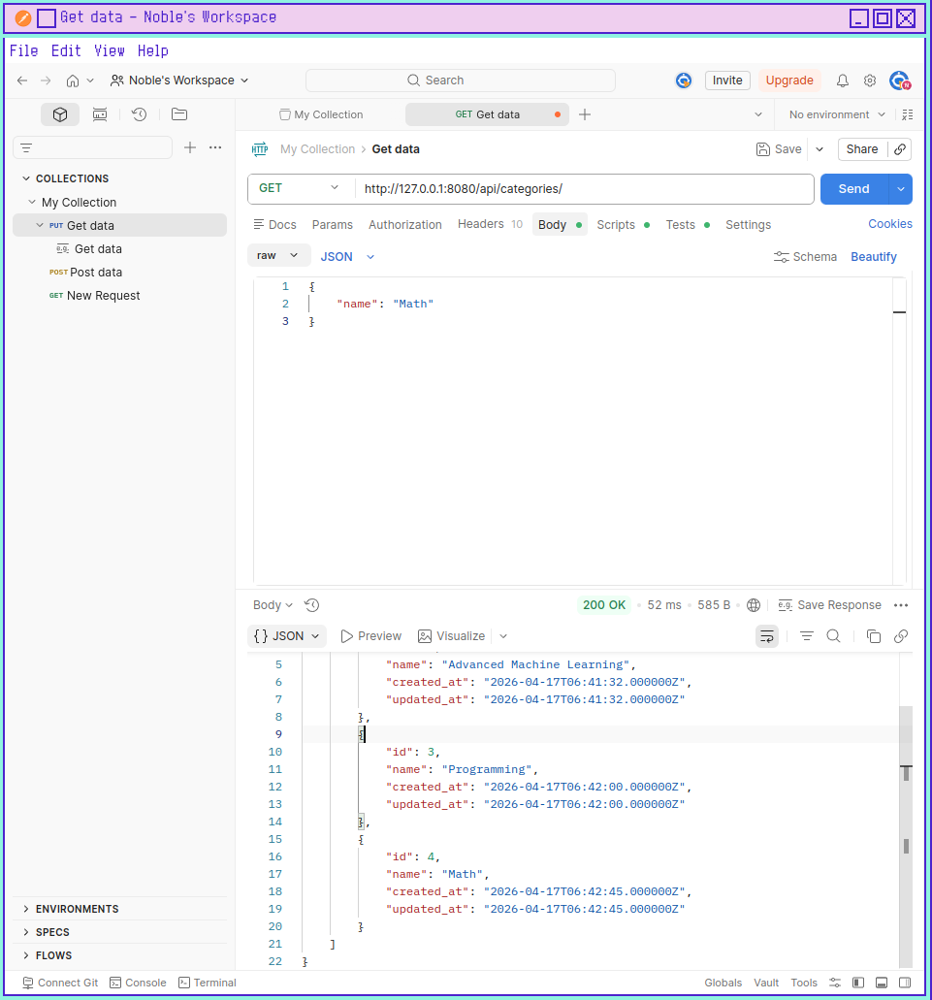  

### 2. Store Category
- **Method:** `POST`
- **URL:** [http://127.0.0.1:8080/api/categories](http://127.0.0.1:8080/api/categories)
- **Body:**
```json
{
    "name": "Programming"
}
```
- **RESPONSE:**
```
{
    "data": {
        "id": 1,
        "name": "Machine Learning",
        "created_at": "2026-04-17T06:23:22.000000Z",
        "updated_at": "2026-04-17T06:23:22.000000Z"
    }
}
```
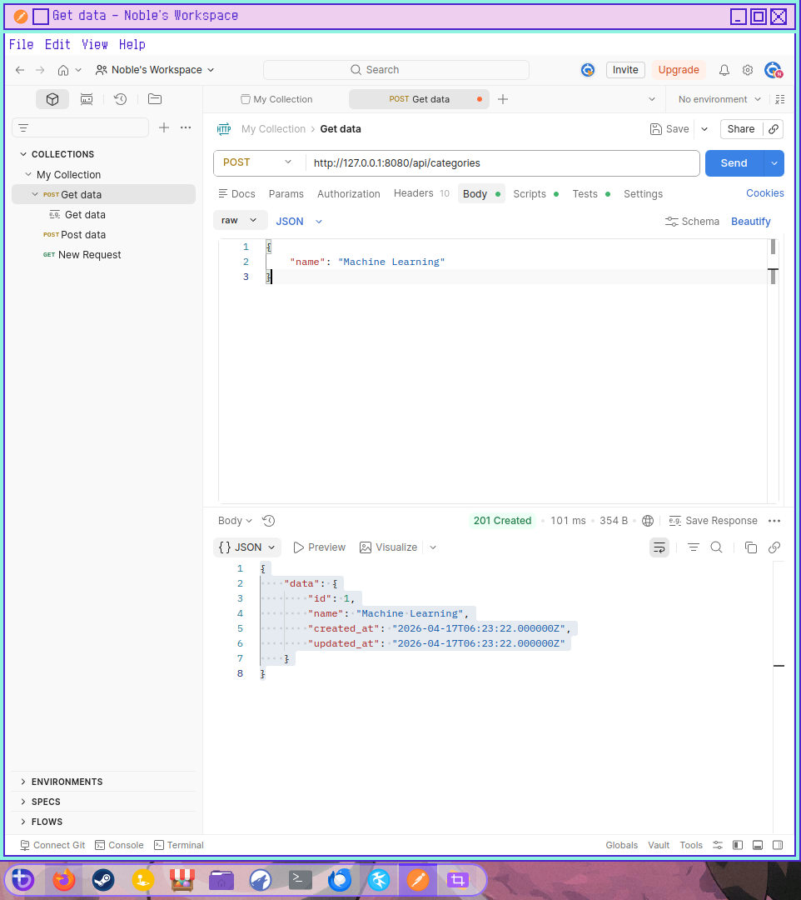  
### 3. Update Category
- **Method:** `PUT/PATCH`
- **URL:** `/categories/{id}`
- **Body:**
```json
{
    "name": "Advanced Machine Learning"
}
```
- **RESPONSE:**
```
{
    "data": {
        "id": 1,
        "name": "Advanced Machine Learning",
        "created_at": "2026-04-17T06:23:22.000000Z",
        "updated_at": "2026-04-17T06:26:58.000000Z"
    }
}
```
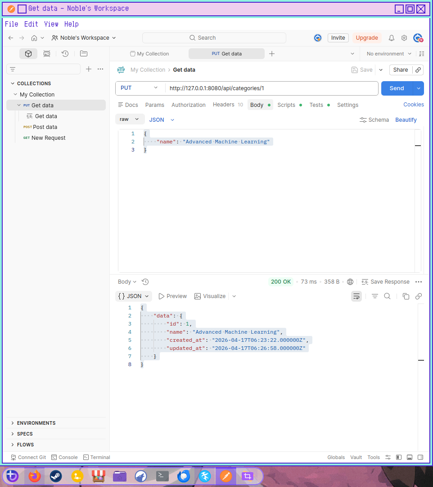  

### 4. Delete Category
- **Method:** `DELETE`
- **URL:** [http://127.0.0.1:8080/api/categories/1](http://127.0.0.1:8080/api/categories/1)  
- **RESPONSE:**
```
{
    "message": "Category deleted successfully"
}
```
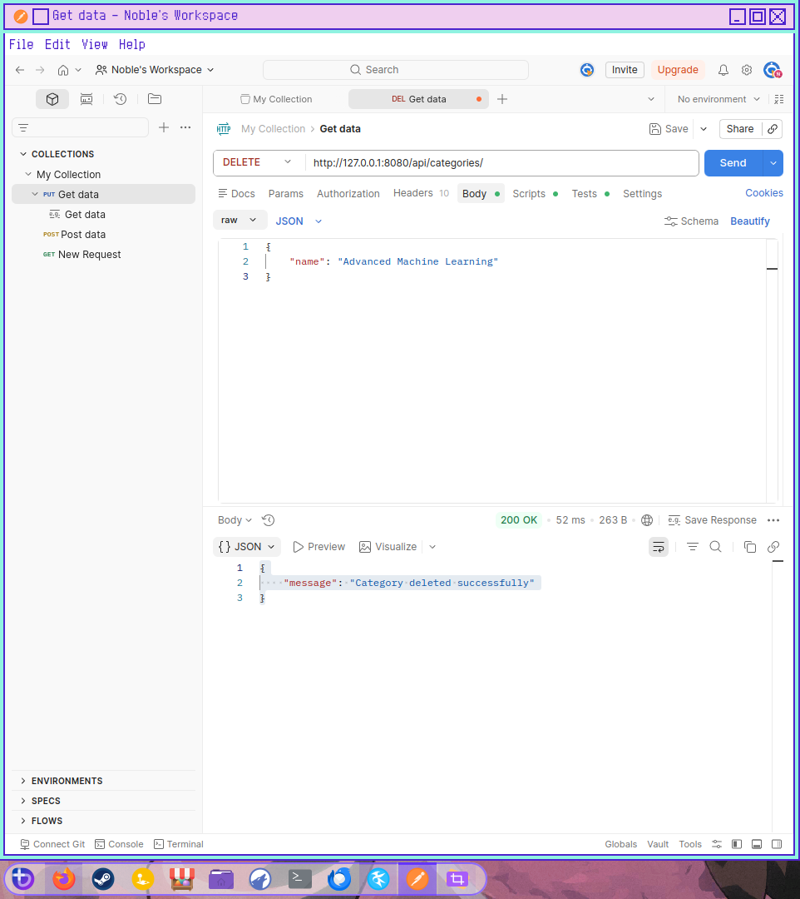  

</details>

## Book Management

<details markdown="1">
<summary>Click to see details</summary>

Semua endpoint di bawah ini membutuhkan header:
`Authorization: Bearer {your_token}`

### 1. Store Book
- **Method:** `POST`
- **URL:** `/books`
- **Body:**
```json
{
    "title": "Machine Learning Lanjut",
    "category_id": 2,
    "author": "Nobel",
    "description": "Comprehensive guide to Machine Learning.",
    "price": 90.0,
    "pdf_url": "https://example.com/books/MachineLearningLanjut.pdf"
}
```
- **RESPONSE:**
```
{
    "data": {
        "id": 1,
        "category_id": 2,
        "category": {
            "id": 2,
            "name": "Advanced Machine Learning",
            "created_at": "2026-04-17T06:41:32.000000Z",
            "updated_at": "2026-04-17T06:41:32.000000Z"
        },
        "title": "Machine Learning Lanjut",
        "author": "Nobel",
        "description": "Comprehensive guide to Machine Learning.",
        "pdf_url": "https://example.com/books/MachineLearningLanjut.pdf",
        "price": 90,
        "created_at": "2026-04-17T06:50:43.000000Z",
        "updated_at": "2026-04-17T06:50:43.000000Z"
    }
}
```

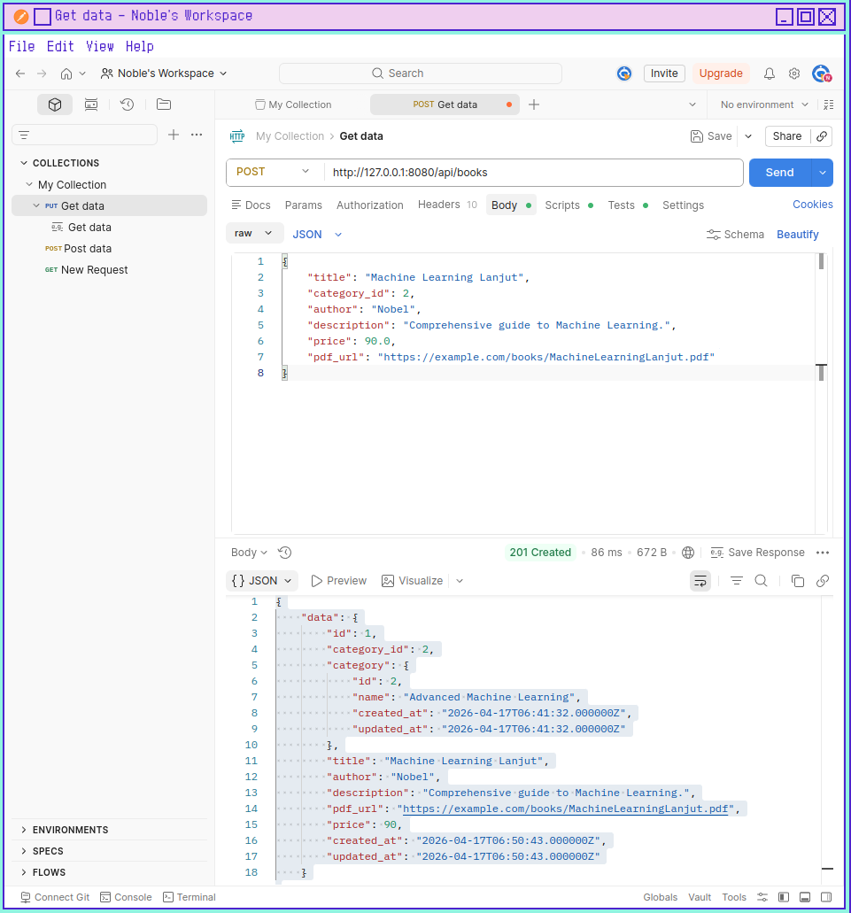  
### 2. Show Book Detail
- **Method:** `GET`
- **URL:** `/books/{id}`

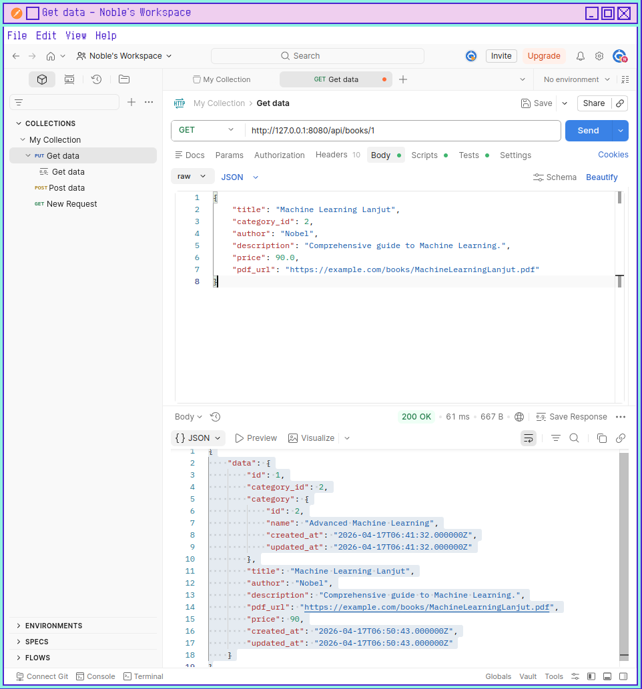  

### 3. Update Book
- **Method:** `PUT/PATCH`
- **URL:** `/books/{id}`
- **Body:** (Semua field bersifat opsional)
```json
{
    "title": "Machine Learning Lanjut",
    "category_id": 2,
    "author": "Irham Nobel",
    "price": 100.0
}
```
- **RESPONSE:**
```
{
    "data": {
        "id": 1,
        "category_id": 2,
        "category": {
            "id": 2,
            "name": "Advanced Machine Learning",
            "created_at": "2026-04-17T06:41:32.000000Z",
            "updated_at": "2026-04-17T06:41:32.000000Z"
        },
        "title": "Machine Learning Lanjut",
        "author": "Irham Nobel",
        "description": "Comprehensive guide to Machine Learning.",
        "pdf_url": "https://example.com/books/MachineLearningLanjut.pdf",
        "price": 100,
        "created_at": "2026-04-17T06:50:43.000000Z",
        "updated_at": "2026-04-17T06:56:02.000000Z"
    }
}
```
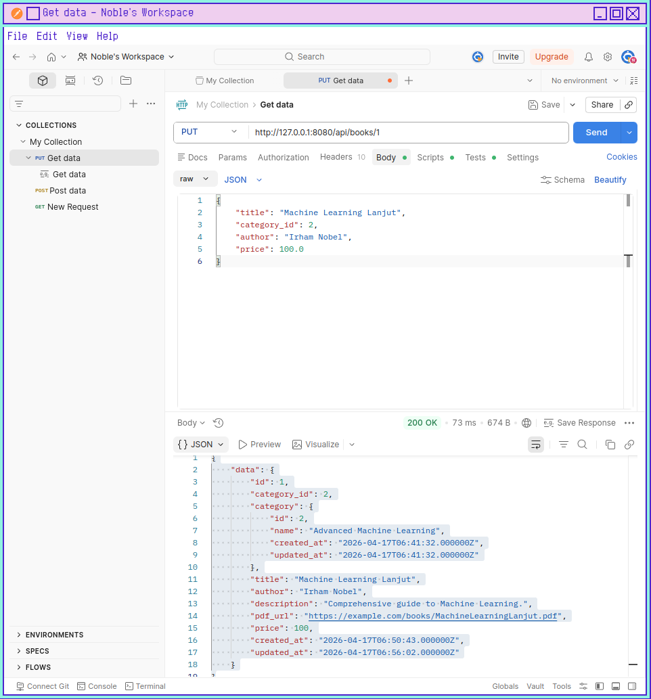  

### 4. Delete Book
- **Method:** `DELETE`
- **URL:** `/books/{id}`
- **RESPONSE:**
```
{
    "message": "Book deleted successfully"
}
```
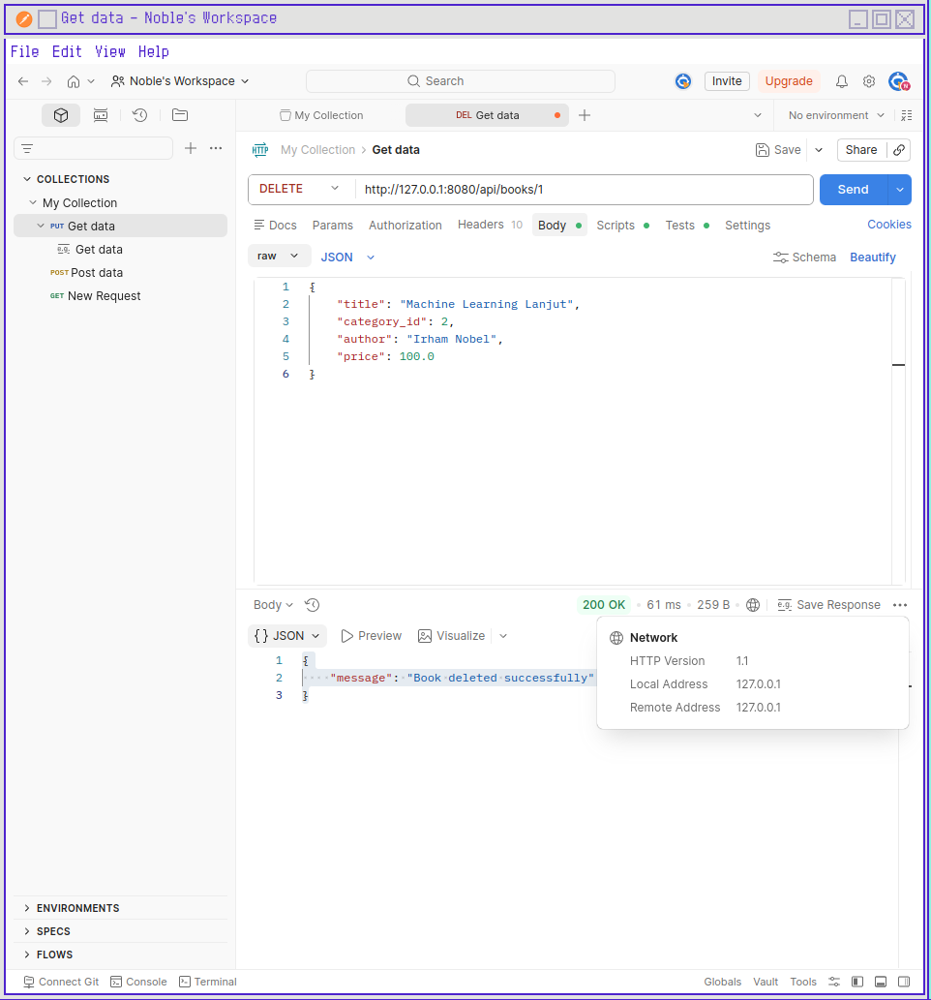  

### 5. List Books (with Search, Filter, & Pagination)
- **Method:** `GET`
- **URL:** `/books`
- **Query Params:**
    - `search`: Cari berdasarkan judul atau penulis (e.g., `?search=Laravel`)
    - `category_id`: Filter berdasarkan ID kategori (e.g., `?category_id=1`)
    - `page`: Nomor halaman (Pagination 5 data per halaman)

- **EXAMPLE:**
```
http://127.0.0.1:8080/api/books/?search=Programming
```

- **Response Example:**
```json
{
    "data": [
        {
            "id": 3,
            "category_id": 3,
            "category": {
                "id": 3,
                "name": "Programming",
                "created_at": "2026-04-17T06:42:00.000000Z",
                "updated_at": "2026-04-17T06:42:00.000000Z"
            },
            "title": "Programming Lanjut",
            "author": "Nobel",
            "description": "Comprehensive guide to Programming.",
            "pdf_url": "https://example.com/books/ProgrammingLanjut.pdf",
            "price": 90,
            "created_at": "2026-04-17T07:03:34.000000Z",
            "updated_at": "2026-04-17T07:05:10.000000Z"
        }
    ],
    "links": {
        "first": "http://127.0.0.1:8080/api/books?page=1",
        "last": "http://127.0.0.1:8080/api/books?page=1",
        "prev": null,
        "next": null
    },
    "meta": {
        "current_page": 1,
        "from": 1,
        "last_page": 1,
        "links": [
            {
                "url": null,
                "label": "&laquo; Previous",
                "page": null,
                "active": false
            },
            {
                "url": "http://127.0.0.1:8080/api/books?page=1",
                "label": "1",
                "page": 1,
                "active": true
            },
            {
                "url": null,
                "label": "Next &raquo;",
                "page": null,
                "active": false
            }
        ],
        "path": "http://127.0.0.1:8080/api/books",
        "per_page": 5,
        "to": 1,
        "total": 1
    }
}
```
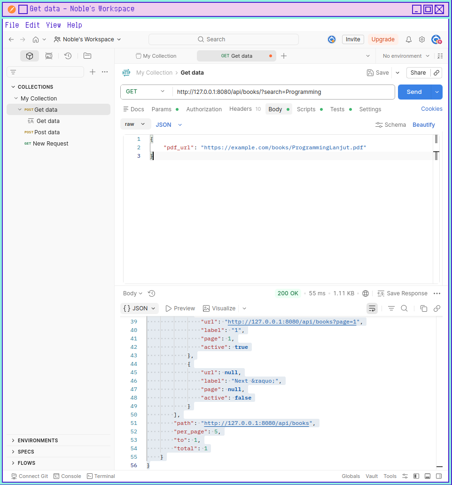

</details>

